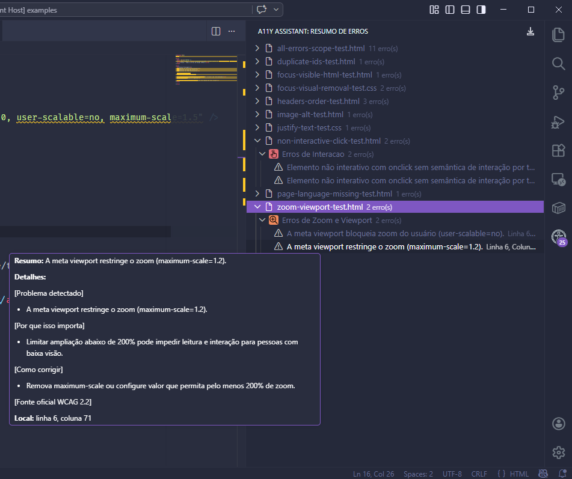
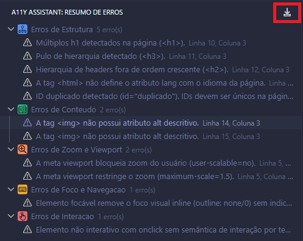
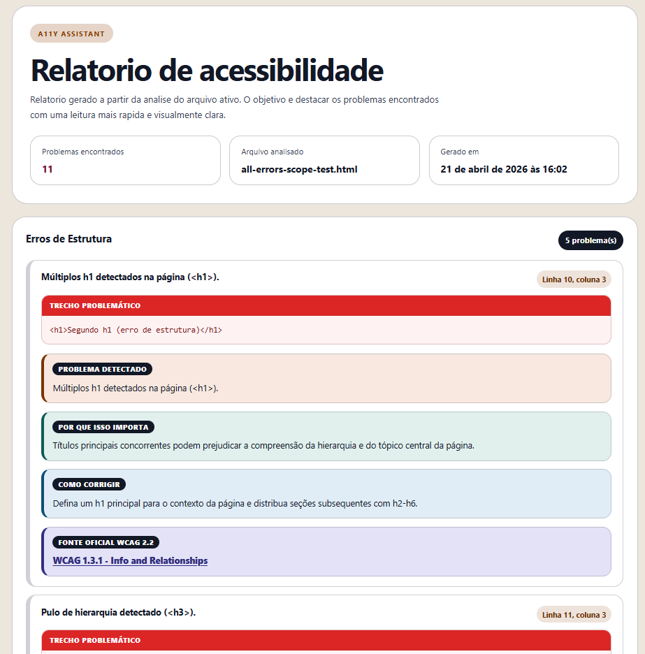
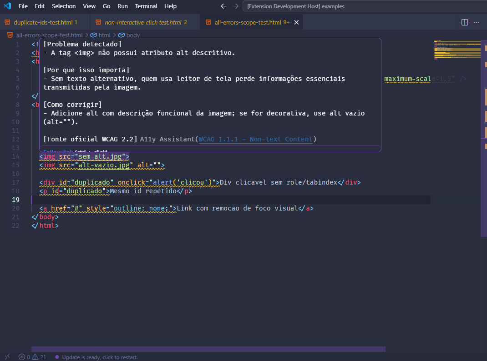

# A11y VSCode Assistant

Extensão para análise proativa de acessibilidade em arquivos HTML e CSS no VS Code. Ela valida o conteúdo em tempo real, destaca problemas no editor, organiza os achados em um painel lateral e exporta um relatório HTML.

## Visão Geral

O motor da extensão funciona sobre o documento ativo e aplica um conjunto de regras educacionais de acessibilidade. Quando encontra um problema, a extensão destaca o trecho no arquivo, mostra uma explicação simples e associa a ocorrência a uma referência WCAG 2.2.

Principais capacidades:

- Validação automática enquanto você digita em arquivos HTML e CSS.
- Painel lateral com resumo categorizado dos problemas.
- Navegação direta do painel para o ponto exato do código.
- Exportação do resumo para um arquivo HTML em Downloads.

## Requisitos

- VS Code `^1.110.0`.
- Arquivos em HTML ou CSS para que as regras sejam executadas.
- Sistema com pasta Downloads acessível para a exportação do relatório.

## Instalação

### Via Marketplace

1. Abra a aba de extensões do VS Code.
2. Pesquise por `A11y VSCode Assistant`.
3. Instale a extensão publicada por `MarcosFernandesF`.
4. Abra um arquivo `.html` ou `.css` para iniciar a análise.

### Via arquivo `.vsix`

1. No VS Code, abra `Extensions`.
2. Clique no menu `...` da área de extensões.
3. Selecione `Install from VSIX...`.
4. Escolha o arquivo `.vsix` da extensão.
5. Reabra ou edite um arquivo `.html` ou `.css` para acionar as validações.

## Como Usar

1. Abra um arquivo HTML ou CSS no editor.
2. Faça alterações no conteúdo.
3. A extensão revalida o documento automaticamente com pequeno atraso para evitar excesso de processamento.
4. Os alertas aparecem no editor e também na lista de problemas do VS Code.
5. Clique no ícone `A11y Assistant` na barra lateral para ver o resumo de erros.
6. Selecione um item do painel para ir direto ao trecho problemático.
7. Use o comando de exportação para gerar o relatório HTML na pasta Downloads.

## Painel de Resumo e Exportação

O painel lateral `Resumo de Erros` fica dentro da visão `A11y Assistant` na Activity Bar.

- O número total de erros ativos aparece no cabeçalho do painel.
- Os problemas são agrupados por categoria para facilitar leitura e priorização.
- Cada item do painel mostra linha, coluna e um texto resumido do alerta.
- Ao clicar em um item, o editor é aberto na posição correspondente do erro.



Para exportar o resultado:

1. Abra um arquivo HTML ou CSS com alertas ou sem alertas.
2. Clique no botão de download no topo do painel `Resumo de Erros` ou execute o comando `A11y: Baixar relatório de acessibilidade`.
3. O relatório é salvo automaticamente em `Downloads` com nome seguro baseado no arquivo atual.
4. Se desejar, use a opção `Abrir relatorio` exibida após a exportação.




## Motor de Regras

A extensão usa regras específicas para cada tipo de arquivo:

- HTML: `img` sem `alt`, hierarquia de títulos, viewport bloqueando zoom, elementos clicáveis não interativos, remoção de foco visual inline, idioma da página e IDs duplicados.
- CSS: texto justificado e remoção de foco visual sem alternativa perceptível.

Cada alerta traz uma mensagem educacional e uma referência WCAG 2.2 associada, para apoiar correção rápida e também aprendizado.

## Exemplos de Uso e Regras

Os exemplos abaixo mostram o que dispara cada alerta e como corrigir o problema.

### 1. Imagem Sem `alt`

Antes:

```html

```

Depois:

```html

```

### 2. Hierarquia de Títulos Fora de Ordem

Antes:

```html
<h1>Produto</h1>
<h3>Detalhes técnicos</h3>
```

Depois:

```html
<h1>Produto</h1>
<h2>Detalhes técnicos</h2>
```

### 3. Viewport Bloqueando Zoom

Antes:

```html
<meta name="viewport" content="width=device-width, initial-scale=1, user-scalable=no">
```

Depois:

```html
<meta name="viewport" content="width=device-width, initial-scale=1">
```

### 4. Elemento Não Interativo com Clique

Antes:

```html
<div onclick="abrirMenu()">Abrir menu</div>
```

Depois:

```html
<button type="button" onclick="abrirMenu()">Abrir menu</button>
```

### 5. Remoção de Foco Visual em HTML e CSS

Antes em HTML:

```html
<a href="/contato" style="outline: none;">Contato</a>
```

Depois em HTML:

```html
<a href="/contato" class="link-focus">Contato</a>
```

Antes em CSS:

```css
.link-focus {
	outline: none;
}
```

Depois em CSS:

```css
.link-focus:focus-visible {
	outline: 3px solid #1d4ed8;
	outline-offset: 2px;
}
```



### 6. Idioma da Página Não Declarado

Antes:

```html
<html>
```

Depois:

```html
<html lang="pt-BR">
```

### 7. IDs Duplicados

Antes:

```html
<section id="hero">...</section>
<div id="hero">...</div>
```

Depois:

```html
<section id="hero">...</section>
<div id="hero-secondary">...</div>
```

### 8. Texto Justificado

Antes:

```css
p {
	text-align: justify;
}
```

Depois:

```css
p {
	text-align: left;
}
```

## Funcionamento Técnico

- A extensão observa as alterações no editor e valida HTML e CSS de forma incremental.
- Os problemas encontrados viram avisos no VS Code.
- O painel lateral organiza os problemas por categoria para facilitar a leitura.
- O relatório exportado reutiliza o mesmo conjunto de erros para manter consistência entre editor, painel e arquivo gerado.

## Licença e Contribuição

Este projeto segue as diretrizes internas do repositório. Se você for adicionar novas regras, mantenha a documentação sincronizada com o comportamento do motor e com os comandos expostos pela extensão.
